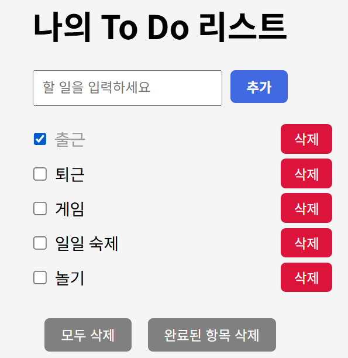

# React Todo App

나만의 할 일 관리 앱입니다.  
React + Vite + Docker를 사용해 개발하였으며,  
간단한 상태 관리, 삭제/완료 기능, localStorage 확장 등을 구현했습니다.

 <!-- 캡처 이미지 넣고 싶으면 사용 -->

## 실행 방법

### 1. 개발 서버 실행

```bash
npm install
npm run dev
```

### 2. 빌드

```bash
npm run build
```

### 3. Docker 이미지 실행

```bash
docker buil -t chyoang30/react-todo-app .
docker run -p 3000:80 chyoang30/react-todo app
```

접속: https://localhost:3000

---

## 주요 기능

- 할 일 입력 및 추가
- 체크 박스로 완료 표시 (+ 취소선, 연한 글씨)
- 삭제 버튼 (개별 및 전체)
- 완료된 항목 일괄 삭제
- 삭제 전 확인창
- Docker 배포 (React 정적 웹)

## DockerHub

👉 [DockerHub에서 보기](https://hub.docker.com/r/chyoang30/react-todo-app)

---

## 기술 스택

- React (w/ Vite)
- HTML/CSS (선택적 스타일 커스터마이징)
- Docker (Nginx로 정적 서빙)

---

## 프로젝트 구조 (간략)

```text
├── public/
├── src/
│ ├── App.jsx
│ ├── TodoItem.jsx
│ ├── index.css
│ └── main.jsx
├── Dockerfile
├── package.json
├── vite.config.js
└── README.md
```

---

## 📸 스크린샷

> 투두 입력 화면, 체크 완료된 항목, 모두 삭제 버튼 등  
> 필요 시 캡처 이미지를 `src/assets`에 넣고 `README.md`에서 보여줄 수 있음

---

## 만든 사람

- GitHub: [@chyoang30](https://github.com/chyoang30)
- DockerHub: [chyoang30](https://hub.docker.com/u/chyoang30)
